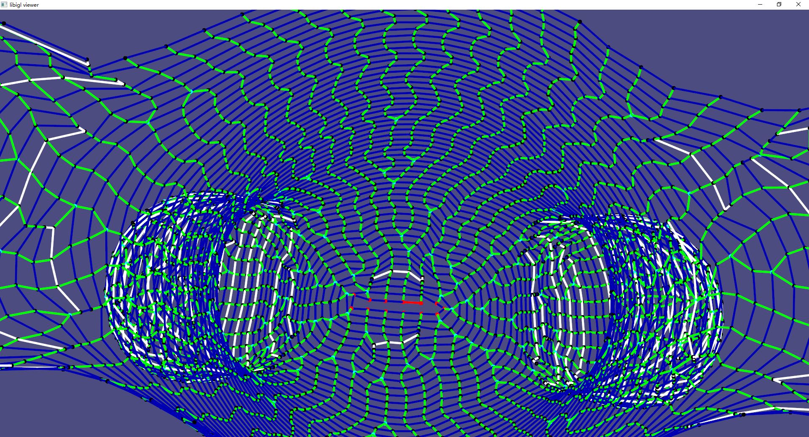

# 3D-Visualizer_st
a 3D-visualizer for .st file generated in project autoknit(https://github.com/textiles-lab/autoknit) and my personal project Scan2knit(https://github.com/ZiniuLu/Scan2knit)

## Image





## Install

1. install libigl at first
2. install `3D-Visualizer_st` and generate `.sln` file

```bash
git clone https://github.com/ZiniuLu/Scan2knit.git
mkdir build
cd build
cmake-gui ..
```

3. open `.sln` file in Visual Studio 2019
4. set `3D-Visualizer_st` as Startup project
5. Build & Run

## Usage

1. build the entire solution in Visual Studio 2019
2. copy .st file into directory `./data/`
3. modify input parameters in the `./settings/Settings.csv` file
4. run `./build/Release/3D-Visualizer_st.exe`

## Example of  Settings.csv

```c++
####,FILE_NAME
FILE_NAME,teddy2.st
,
####,PARAMETER
first-line,1000
length,2000
```

